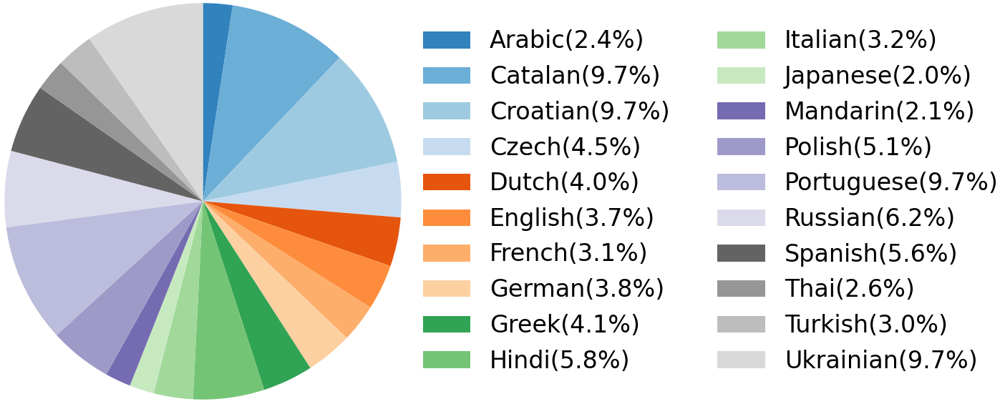

## Overview
MultiTalk dataset is a new multilingual 2D video dataset featuring over 420 hours of talking videos across 20 languages. 
It contains 293,812 clips with a resolution of 512x512, a frame rate of 25 fps, and an average duration of 5.19 seconds per clip.
The dataset shows a balanced distribution across languages, with each language representing between 2.0% and 9.7% of the total.  

<b>Detailed statistics</b>

| Language | Total Duration(h) | #Clips | Avg. Duration(s) | Annotation |
|:---:|:---:|:---:|:---:|:---:|
| Arabic | 10.32 | 9048 | 4.11 | [arabic.json](https://github.com/postech-ami/MultiTalk/tree/main/MultiTalk_Dataset/annotations/arabic.json) |
| Catalan | 41.0 |  29232 | 5.05 | [catalan.json](https://github.com/postech-ami/MultiTalk/tree/main/MultiTalk_Dataset/annotations/catalan.json) |
| Croatian | 41.0 |  25465 | 5.80 | [croatian.json](https://github.com/postech-ami/MultiTalk/tree/main/MultiTalk_Dataset/annotations/croatian.json) |
| Czech | 18.9 | 11228 | 6.06 | [czech.json](https://github.com/postech-ami/MultiTalk/tree/main/MultiTalk_Dataset/annotations/czech.json) |
| Dutch | 17.05 | 14187 | 4.33 | [dutch.json](https://github.com/postech-ami/MultiTalk/tree/main/MultiTalk_Dataset/annotations/dutch.json) |
| English | 15.49 |  11082 | 5.03 | [english.json](https://github.com/postech-ami/MultiTalk/tree/main/MultiTalk_Dataset/annotations/english.json) |
| French | 13.17 |  11576 | 4.10 | [french.json](https://github.com/postech-ami/MultiTalk/tree/main/MultiTalk_Dataset/annotations/french.json) |
| German | 16.25 | 10856 | 5.39 | [german.json](https://github.com/postech-ami/MultiTalk/tree/main/MultiTalk_Dataset/annotations/german.json) |
| Greek | 17.53 | 12698 | 4.97 | [greek.json](https://github.com/postech-ami/MultiTalk/tree/main/MultiTalk_Dataset/annotations/greek.json) |
| Hindi | 24.41 | 16120 | 5.45 | [hindi.json](https://github.com/postech-ami/MultiTalk/tree/main/MultiTalk_Dataset/annotations/hindi.json) |
| Italian | 13.59 | 9753 | 5.02 | [italian.json](https://github.com/postech-ami/MultiTalk/tree/main/MultiTalk_Dataset/annotations/italian.json) |
| Japanese | 8.36 | 5990 | 5.03 | [japanese.json](https://github.com/postech-ami/MultiTalk/tree/main/MultiTalk_Dataset/annotations/japanese.json) |
| Mandarin | 8.73 | 6096 | 5.15 | [mandarin.json](https://github.com/postech-ami/MultiTalk/tree/main/MultiTalk_Dataset/annotations/mandarin.json) |
| Polish | 21.58 | 15181 | 5.12 | [polish.json](https://github.com/postech-ami/MultiTalk/tree/main/MultiTalk_Dataset/annotations/polish.json) |
| Portuguese | 41.0 | 25321 | 5.83 | [portuguese.json](https://github.com/postech-ami/MultiTalk/tree/main/MultiTalk_Dataset/annotations/portuguese.json) |
| Russian | 26.32 | 17811 | 5.32 | [russian.json](https://github.com/postech-ami/MultiTalk/tree/main/MultiTalk_Dataset/annotations/russian.json) |
| Spanish | 23.65 | 18758 | 4.54 | [spanish.json](https://github.com/postech-ami/MultiTalk/tree/main/MultiTalk_Dataset/annotations/spanish.json) |
| Thai | 10.95 | 7595 | 5.19 | [thai.json](https://github.com/postech-ami/MultiTalk/tree/main/MultiTalk_Dataset/annotations/thai.json) |
| Turkish | 12.9 | 11165 | 4.16 | [turkish.json](https://github.com/postech-ami/MultiTalk/tree/main/MultiTalk_Dataset/annotations/turkish.json) |
| Ukrainian | 41.0 | 24650 | 5.99 | [ukrainian.json](https://github.com/postech-ami/MultiTalk/tree/main/MultiTalk_Dataset/annotations/ukrainian.json) |

