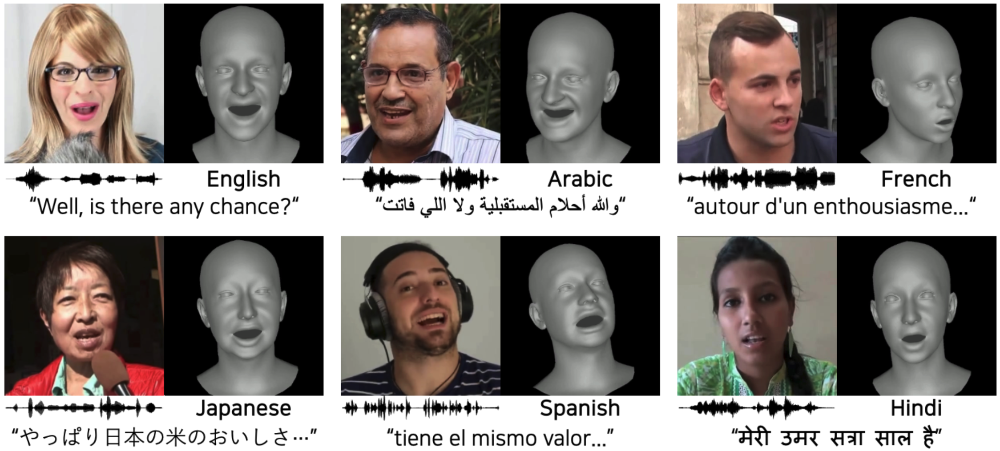

# MultiTalk (INTERSPEECH 2024)

### [Project Page](https://multi-talk.github.io/) | [Paper](https://arxiv.org/abs/2406.14272) | [Dataset](https://github.com/postech-ami/MultiTalk/blob/main/MultiTalk_dataset/README.md)
This repository contains a pytorch implementation for the Interspeech 2024 paper, [MultiTalk: Enhancing 3D Talking Head Generation Across Languages with Multilingual Video Dataset](https://multi-talk.github.io/). MultiTalk generates 3D talking head with enhanced multilingual performance.<br><br>

 

## Getting started
This code was developed on Ubuntu 18.04 with Python 3.8, CUDA 11.3 and PyTorch 1.12.0. Later versions should work, but have not been tested.

### Installation
Create and activate a virtual environment to work in:
```
conda create --name multitalk python=3.8
conda activate multitalk
```

Install [PyTorch](https://pytorch.org/). For CUDA 11.3 and ffmpeg, this would look like:
```
pip install torch==1.12.0+cu113 torchvision==0.13.0+cu113 torchaudio==0.12.0 --extra-index-url https://download.pytorch.org/whl/cu113
conda install -c conda-forge ffmpeg
```

Install the remaining requirements with pip:
```
pip install -r requirements.txt 
```

Compile and install `psbody-mesh` package:
[MPI-IS/mesh](https://github.com/MPI-IS/mesh)
```
BOOST_INCLUDE_DIRS=/usr/lib/x86_64-linux-gnu make all
```


### Download models
To run MultiTalk, you need to download stage1 and stage2 model, and the template file of mean face in FLAME topology,
Download [stage1 model](https://drive.google.com/file/d/1jI9feFcUuhXst1pM1_xOMvqE8cgUzP_t/view?usp=sharing | [stage2 model](https://drive.google.com/file/d/1zqhzfF-vO_h_0EpkmBS7nO36TRNV4BCr/view?usp=sharing) | [template](https://drive.google.com/file/d/1WuZ87kljz6EK1bAzEKSyBsZ9IlUmiI-i/view?usp=sharing) and download FLAME_sample.ply from [voca](https://github.com/TimoBolkart/voca/tree/master/template).

After downloading the models, place them in `./checkpoints`.
```
./checkpoints/stage1.pth.tar
./checkpoints/stage2.pth.tar
./checkpoints/FLAME_sample.ply
```

## Demo
Run below command to train the model.
We provide sample audios in **./demo/input**.
```
sh scripts/demo.sh multi
```

To use wav2vec of `facebook/wav2vec2-large-xlsr-53`, please move to `/path/to/conda_environment/lib/python3.8/site-packages/transformers/models/wav2vec2/processing_wav2vec2.py` and change the code as below.
```
L105: tokenizer = Wav2Vec2CTCTokenizer.from_pretrained(pretrained_model_name_or_path, **kwargs)
to
L105: tokenizer=Wav2Vec2CTCTokenizer.from_pretrained("facebook/wav2vec2-base-960h",**kwargs)
```

## Agreement
- The MultiTalk dataset is provided for non-commercial research purposes only. 
- All videos of the MultiTalk dataset are sourced from the Internet and do not belong to our institutions. Our institutions do not take responsibility for the content or the meaning of these videos.
- You agree not to reproduce, duplicate, copy, sell, trade, resell, or exploit any portion of the videos and any portion of derived data for commercial purposes.
- You agree not to further copy, publish, or distribute any portion of the MultiTalk dataset. Except, it is allowed to make copies of the dataset for internal use at a single site within the same organization.

## MultiTalk Dataset
Please follow the instructions in [MultiTalk_dataset/README.md](https://github.com/postech-ami/MultiTalk/blob/main/MultiTalk_dataset/README.md).

## Training and testing

### Training for Discrete Motion Prior
```
sh scripts/train_multi.sh MultiTalk_s1 config/multi/stage1.yaml multi s1
```

### Training for Speech-Driven Motion Synthesis
Make sure the paths of pre-trained models are correct, i.e.,`vqvae_pretrained_path` and `wav2vec2model_path` in `config/multi/stage2.yaml`.
```
sh scripts/train_multi.sh MultiTalk_s2 config/multi/stage2.yaml multi s2
```

### Testing
#### Lip Vertex Error (LVE)
For evaluating the lip vertex error, please run below command.

```
sh scripts/test.sh MultiTalk_s2 config/multi/stage2.yaml vocaset s2
```

#### Audio-Visual Lip Reading (AVLR)
For evaluating lip readability with a pre-trained Audio-Visual Speech Recognition (AVSR), download language specific checkpoint, dictionary, and tokenizer from [muavic](https://github.com/facebookresearch/muavic).   
Place them in `./avlr/${language}/checkpoints/${language}_avlr`.
```
# e.g "Arabic" 
./avlr/ar/checkpoints/ar_avsr/checkpoint_best.pt
./avlr/ar/checkpoints/ar_avsr/dict.ar.txt
./avlr/ar/checkpoints/ar_avsr/tokenizer.model
```
And place the rendered videos in `./avlr/${language}/inputs/MultiTalk`, corresponding wav files in `./avlr/${language}/inputs/wav`.
```
# e.g "Arabic" 
./avlr/ar/inputs/MultiTalk
./avlr/ar/inputs/wav
```

Run below command to evaluate lip readability.
```
python eval_avlr/eval_avlr.py --avhubert-path ./av_hubert/avhubert --work-dir ./avlr --language ${language} --model-name MultiTalk --exp-name ${exp_name}
```


[//]: # (## **Citation**)

[//]: # ()
[//]: # (If you find the code useful for your work, please star this repo and consider citing:)

[//]: # ()
[//]: # (```)

[//]: # (@inproceedings{xing2023codetalker,)

[//]: # (  title={Codetalker: Speech-driven 3d facial animation with discrete motion prior},)

[//]: # (  author={Xing, Jinbo and Xia, Menghan and Zhang, Yuechen and Cun, Xiaodong and Wang, Jue and Wong, Tien-Tsin},)

[//]: # (  booktitle={Proceedings of the IEEE/CVF Conference on Computer Vision and Pattern Recognition},)

[//]: # (  pages={12780--12790},)

[//]: # (  year={2023})

[//]: # (})

[//]: # (```)

## **Notes**
1. Although our codebase allows for training with multi-GPUs, we did not test it and just hardcode the training batch size as one. You may need to change the `data_loader` if needed.


## **Acknowledgement**
We heavily borrow the code from
[CodeTalk](https://doubiiu.github.io/projects/codetalker/) and [CelebV-HQ](https://github.com/CelebV-HQ/CelebV-HQ?tab=readme-ov-file), and the agreement statement from [CelebV-HQ](https://github.com/CelebV-HQ/CelebV-HQ?tab=readme-ov-file). We sincerely appreciate those authors.

